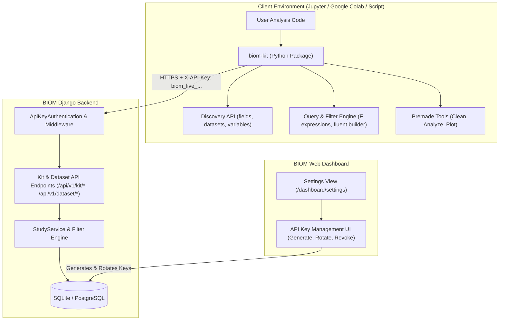

# BIOM Kit & Dashboard API Key Integration Plan

## Executive Summary
This document outlines the end-to-end architecture and implementation roadmap for **BIOM Kit** (`biom-kit`) and the accompanying **API Key Authentication & Management** system inside the BIOM platform.

### Objectives
1. **API Key Generation & Rotation**: Allow staff and superadmin users to securely generate, inspect (masked), copy, rotate, and revoke personal API keys from the website dashboard settings view (`/dashboard/settings`).
2. **Secure Authentication Layer**: Provide a robust DRF / Django authentication mechanism (`ApiKeyAuthentication`) that resolves incoming requests from `biom-kit` using `X-API-Key` or `Authorization: Bearer <key>` headers without exposing raw database secrets (SHA-256 hash storage).
3. **Data Discovery & Type-Aware Filtering Endpoints**: Expose intuitive endpoints on the BIOM Django backend for inspecting patient profile variables, available datasets (studies), dataset variables, and executing type-aware filtering (e.g. `equals`, `gt`, `gte`, `lt`, `lte`, `between`, `contains`, `starts_with`, `in`, `is_empty`).
4. **`biom-kit` Python Package**: A pip-installable public package tailored for Jupyter Notebooks, Google Colab, and Python scripts. It abstracts all HTTP communication, providing an intuitive, developer-friendly interface to:
   - Discover available fields, datasets, and variables on command.
   - Filter and query data using fluent method chaining or declarative `F` expressions.
   - Convert results directly into pandas DataFrames.
   - Run premade tools for **cleaning** (missing value handling, outlier detection, type casting), **analysis** (summary statistics, correlation matrices, subgroup aggregations), and **plotting** (publication-ready visual charts).
5. **Rigorous Step-by-Step Execution**: Automated tests at every layer (backend unit/integration tests and client package tests) to ensure zero regressions and high reliability.

---

## Architecture Overview

---

## Detailed Phase Breakdown

| Phase | Title | Document | Scope & Deliverables |
|---|---|---|---|
| **Phase 1** | Dashboard Settings & API Key Auth | [phase_1_api_key_and_settings.md](file:///d:/Dev/Python/BIOM/plans/phase_1_api_key_and_settings.md) | `ApiKey` model (SHA-256 hashed, masked prefix), `ApiKeyAuthentication` class, Settings view & UI in dashboard with one-time copy modal & key rotation, sidebar & navbar links. |
| **Phase 2** | Backend API & Discovery Endpoints | [phase_2_backend_api_and_discovery.md](file:///d:/Dev/Python/BIOM/plans/phase_2_backend_api_and_discovery.md) | REST API endpoints for discovery (profile fields, dataset list, variable schema) and optimized query endpoint supporting single/multi-dataset filtering, pagination, sorting, and records output. |
| **Phase 3** | `biom-kit` Package Architecture | [phase_3_biom_kit_package_architecture.md](file:///d:/Dev/Python/BIOM/plans/phase_3_biom_kit_package_architecture.md) | Standard Python package in `biom-kit/`, `pyproject.toml`, client discovery methods, fluent/declarative query builder, DataFrame converter, premade cleaning, analysis, and plotting tools. |
| **Phase 4** | Testing & Verification Roadmap | [phase_4_testing_and_verification.md](file:///d:/Dev/Python/BIOM/plans/phase_4_testing_and_verification.md) | Backend unit/integration tests for API key lifecycle and auth; `biom-kit` client tests (mocked & integration); Colab/Jupyter compatibility demo notebook; packaging verification. |

---

## Guiding Principles & Constraints
1. **Zero Raw Key Storage**: Store only SHA-256 hashes in the database. The plaintext key (`biom_live_<token>`) is only visible once upon generation/rotation.
2. **Framework Compliance**: Adhere strictly to the Vvecon Zorion framework patterns (Views, APIs, Services, and `R` object) without modifying `vvecon/zorion/` core files.
3. **Limitless Dashboard Aesthetics**: The Settings UI must perfectly match the existing Limitless theme (supporting light and dark mode, responsive cards, Phosphor/Bootstrap icons).
4. **Developer Experience (DX) First**: `biom-kit` must feel effortless in Jupyter Notebook and Google Colab, displaying formatted tables/DataFrames for discovery, helpful error messages, and intuitive chaining for data analysis.
