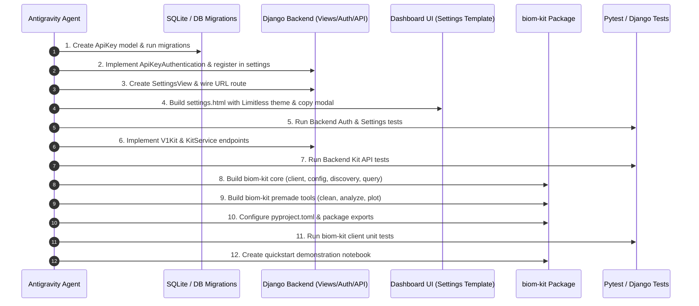

# Phase 4: Testing, Verification & Rollout Strategy

## Overview
This phase provides the testing and validation matrix to guarantee that both the backend infrastructure (Django API Key, Settings view, REST discovery endpoints) and the frontend client package (`biom-kit`) operate reliably, securely, and seamlessly together.

---

## 1. Backend Test Suite

### 1.1 Test File: `test/test_api_key_auth.py`
Automated Django unit and integration tests covering:
- **`ApiKey` Model Lifecycle**:
  - Key token generation structure (`biom_live_<32 hex chars>`).
  - Correct SHA-256 hash persistence (verifying plaintext is never saved in the database).
  - Prefix generation (`biom_live_a1b2...`).
  - Active key creation, revocation, and rotation.
  - Ensuring rotating a key sets `is_active=False` and `revoked_at` on the previous key.
- **`ApiKeyAuthentication` Layer**:
  - Valid key in `X-API-Key` header authenticates user.
  - Valid key in `Authorization: Bearer <key>` header authenticates user.
  - Valid key in `Authorization: Api-Key <key>` header authenticates user.
  - Invalid key returns `401 Unauthorized`.
  - Revoked key returns `401 Unauthorized`.
  - Non-staff / non-superuser key returns `403 Permission Denied`.
  - Inactive user with valid key returns `401/403`.
  - `last_used_at` timestamp is updated upon successful authentication.

---

### 1.2 Test File: `test/test_settings_view.py`
Automated tests for Dashboard Settings UI & endpoints:
- Anonymous user visiting `/dashboard/settings` is redirected to login.
- Regular (non-staff) user visiting `/dashboard/settings` receives 403 or redirect.
- Staff user visiting `/dashboard/settings` gets 200 OK and renders settings template.
- POST `/dashboard/settings/api-key/generate` generates key and returns one-time plaintext key.
- POST `/dashboard/settings/api-key/revoke` revokes the key.

---

### 1.3 Test File: `test/test_kit_api.py`
Automated tests for programmatic Kit endpoints:
- `GET /api/v1/kit/auth/verify`: Verifies authentication status.
- `GET /api/v1/kit/fields`: Returns known patient fields and operator lists.
- `GET /api/v1/kit/datasets`: Returns active studies.
- `GET /api/v1/kit/datasets/<id>/variables`: Returns dataset variables and types.
- `POST /api/v1/kit/query`:
  - Number filtering (`gt`, `lte`, `between`).
  - Text filtering (`equals`, `contains`, `starts_with`).
  - Date filtering (`before`, `after`, `between`).
  - Boolean filtering (`equals`).
  - Combined `AND` and `OR` logic.
  - Output records format verification.

---

## 2. `biom-kit` Client Test Suite

### Location: `biom-kit/tests/`
Uses `pytest` and `responses` to mock HTTP interactions and validate client logic offline:

```
biom-kit/tests/
├── conftest.py               # Shared fixtures, mock API client, sample dataframes
├── test_client.py            # Client initialization, headers, session, auth failure
├── test_discovery.py         # fields(), datasets(), variables(), search_variables()
├── test_query_builder.py     # Fluent query syntax, F expressions, operator serialization
├── test_tools_cleaning.py    # clean_dataset(), summarize_health(), detect_outliers()
├── test_tools_analysis.py    # summarize(), correlation_matrix(), group_summary()
└── test_tools_plotting.py    # plot_distribution(), plot_correlation_matrix() headless tests
```

### Key Test Scenarios:
1. **Query Expression Compilation**:
   - `(F("age") >= 20) & (F("gender") == "Female")` properly compiles into the backend JSON filter payload.
   - Suffix parsing (`age__gte=20`, `testedDate__between=("2024-01-01", "2024-12-31")`).
2. **DataFrame Conversion**:
   - Query response converts directly to `pandas.DataFrame`.
   - Empty results return empty DataFrame with appropriate column headers.
3. **Premade Tools Headless Execution**:
   - Verify `matplotlib.use('Agg')` executes without GUI display errors in headless CI/CD environments.
   - Test `clean_dataset` handles missing values, coerced numbers, and ISO dates properly.

---

## 3. Jupyter Notebook & Google Colab Quickstart Validation

### Verification Artifact: `biom-kit/examples/quickstart.ipynb`
A complete working notebook demonstrating:
1. Package installation: `!pip install -e .`
2. Setting API credentials with `biom.login(...)`.
3. Discovering fields via `biom.fields()`.
4. Inspecting datasets via `biom.datasets()`.
5. Running a filtered query and loading into `df`.
6. Cleaning data with `biom.tools.clean_dataset(df)`.
7. Calculating correlations and distribution statistics.
8. Generating visual plots (distributions, box plots, correlation heatmaps).

---

## 4. Step-by-Step Implementation Sequence



---

## 5. Execution Progress Checklist

- [ ] **Step 1**: `ApiKey` Model in `authentication/models/ApiKey.py` & Database Migration.
- [ ] **Step 2**: `ApiKeyAuthentication` in `authentication/auth/ApiKeyAuthentication.py` & DRF settings registration.
- [ ] **Step 3**: `SettingsView` in `admins/views/SettingsView.py` & navigation links in sidebar/navbar.
- [ ] **Step 4**: Limitless-themed `settings.html` with masked key, generate/rotate/revoke actions, and one-time copy modal.
- [ ] **Step 5**: Test backend API key creation, rotation, revocation, and header authentication.
- [ ] **Step 6**: Implement `V1Kit` API and `KitService` for fields, datasets, variables discovery & structured queries.
- [ ] **Step 7**: Test backend discovery and query filtering endpoints.
- [ ] **Step 8**: Scaffold `biom-kit` package with `pyproject.toml`, `client.py`, `config.py`, `discovery.py`, `query.py`, and `dataset.py`.
- [ ] **Step 9**: Implement premade tools in `biom.tools` (`cleaning.py`, `analysis.py`, `plotting.py`).
- [ ] **Step 10**: Write and run comprehensive `pytest` suite for `biom-kit`.
- [ ] **Step 11**: Create `biom-kit/examples/quickstart.ipynb` and verify Colab/Jupyter compatibility.
